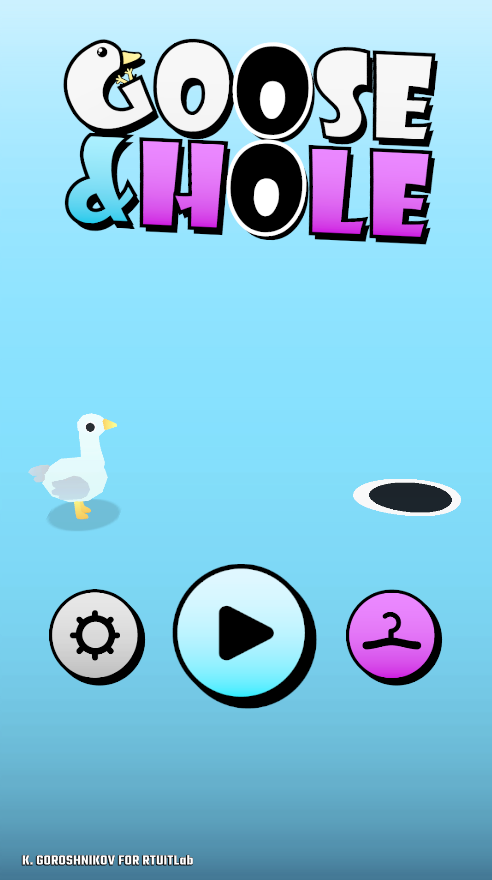
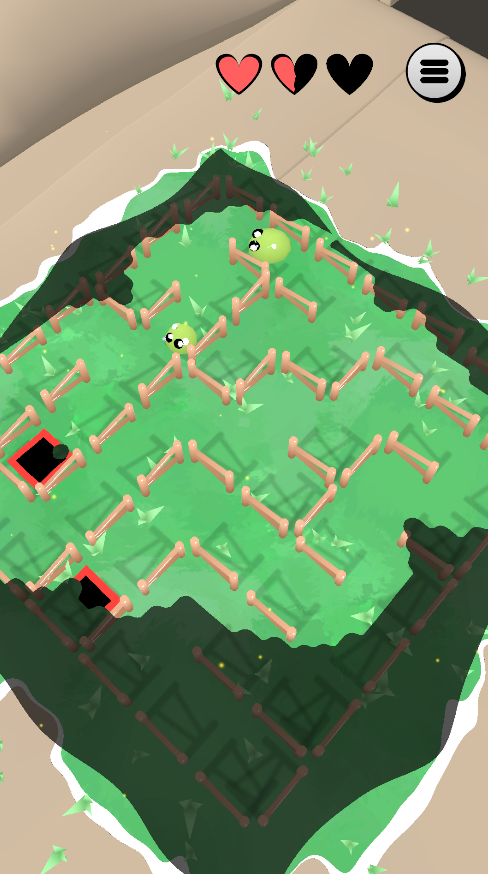
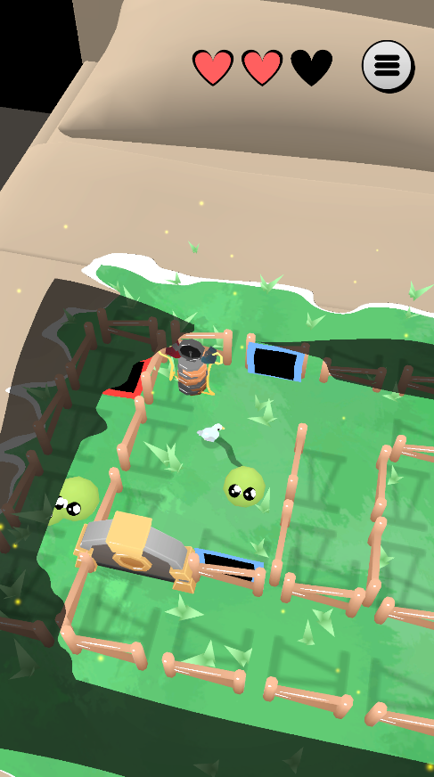
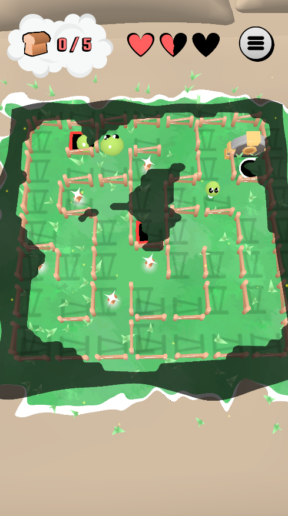
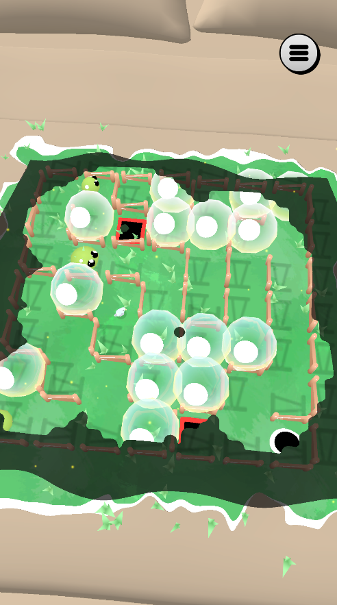

# Goose And Hole

Here is a [Video](https://drive.google.com/drive/folders/1eWW6fSio5qc69T7_2KNM-jqxNeUk-01c?usp=drive_link) demonstrating the gameplay!

## Overview
Goose And Hole is a top-down casual mobile game in which you control a goose moving through a dynamic, randomly generated maze. Using your phone, you guide the goose through challenging mazes full of puzzles and dangers. The game combines pathfinding and light puzzle mechanics to create a unique experience.

## Concept and features

**Idea**  
You play as a goose who is trying to catch a hole. When moving, the goose curls up into a ball and rolls! Each level is randomly generated, so you can complete the same level several times. The maze consists of fences and rooms, each with a unique puzzle. The game contains 10 unique levels.

**Features**  
- **Mazes are randomly generated**  
Each level is different! 
- **Dynamic room generation**  
Each room has unique puzzles.
- **Interactive environment**  
Explore the maze with various obstacles and enemies.
- **Simple controls**  
Use the tilts of the device to control the movements of the goose.
- **Cool visual effects**  
Enjoy the cute cartoon graphics.

## Screenshots
<table>
  <tr>
    <td></td>
    <td></td>
    <td></td>
    <td></td>
    <td></td>
  </tr>
</table>

## Install
You can download apk file of the game from the Releases and install it on Android. (Minimum Android version is 9.0 'Pie')  

**OR**

The app is designed for Android.  
You can run the Unity project on Windows  

1. Clone the Repository 
   ```bash
   git clone https://github.com/KGoroshnikov/DucksAndHoles.git
2. Open the Project in Unity  
   Version - Unity 6 (6000.0.32f1)
3. **If** you want to test the game in the editor, then most likely you will need an additional application on your Android: [GYROSCOPE Repository](https://github.com/KGoroshnikov/GYROSCOPE.git)  
Detailed installation instructions are available in the repository.
You need this app to receive data from your phone's gyroscope in Unity Editor.  
<sub><i>Sorry for the difficulties, but otherwise, how can I test the mechanics of controlling a character using a gyroscope during development?</i></sub>
